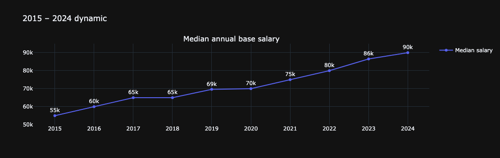

## 📊 IT Salary Survey Report for German IT Specialists
### 🔥 New 2024 report is available! 🔥

### 🚀 💼 **[Click Here to View the Salary Survey Report 2024](https://ksyula.github.io/Salary-report/)** 💼 🚀  

  

An anonymous salary survey has been traditionally conducted annually since 2015 among European IT specialists in Germany. Below, you will find an in-depth reports of the aggregated anonymised responses from voluntary participants during 2019-2024.

###  🎯 Purpose
The primary goal of this survey is to assess the market value of IT skill sets, taking into account factors like years of experience, job position, tools proficiency, and more. In the survey report you will find a comprehensive comparative analysis of anonymized data collected from voluntary participants across Germany. You’re also invited to explore detailed analytics from previous years’ surveys in the archived articles. For example, the first chart of this report illustrates the trend in the median annual base salary among respondents since 2015.

  

### 👥 Audience 

Since 2015, an anonymous salary survey has been conducted annually among European IT specialists, with a particular focus on Germany. From 2021 year, the scope was refined even further, dedicating the survey exclusively to Germany. This shift was driven by the significant economic differences across European countries — such as variations in taxation and cost of living — that heavily influence local salary benchmarks. Most respondents are expats living in Germany and working either for Germany or abroad (remote).

### 📂 Additional Resources
- 📊 **Previous reports**:
  - [Salary survey report 2023](https://github.com/Ksyula/Salary-report/blob/master/Salary_servey_report_2023/salary-report-2023.ipynb)
  - [Salary survey report 2022](https://nbviewer.org/github/Ksyula/Salary-report/blob/master/Salary_servey_report_2022/salary-report-2022.ipynb)
  - [Salary survey report 2021](https://nbviewer.org/github/Ksyula/Salary-report/blob/master/Salary_servey_report_2021/salary-report-2021.ipynb)
  - [Salary survey report 2020](https://nbviewer.org/github/Ksyula/Salary-report/blob/master/Salary_servey_report_2020/salary-report-2020.ipynb)
  - [Salary survey report 2019](https://nbviewer.org/github/Ksyula/Salary-report/blob/master/Salary_servey_report_2019/salary-report-2019.ipynb)
  
- 📁 **Previously collected raw datasets (2019-2024)** are available here:
  - [2024](https://docs.google.com/spreadsheets/d/1DjPgQeBu53I0Dws4YMbXyyQdWDLpMtkSu4FhGux0epY/edit#gid=1460051036)
  - [2023](https://docs.google.com/spreadsheets/d/1DjPgQeBu53I0Dws4YMbXyyQdWDLpMtkSu4FhGux0epY/edit#gid=1460051036)
  - [2022](https://docs.google.com/spreadsheets/d/1DjPgQeBu53I0Dws4YMbXyyQdWDLpMtkSu4FhGux0epY/edit#gid=850609584&fvid=576133863)
  - [2021](https://docs.google.com/spreadsheets/d/1DjPgQeBu53I0Dws4YMbXyyQdWDLpMtkSu4FhGux0epY/edit#gid=799804580)
  - [2020](https://docs.google.com/spreadsheets/d/1DjPgQeBu53I0Dws4YMbXyyQdWDLpMtkSu4FhGux0epY/edit#gid=1727021736)
  - [2019](https://docs.google.com/spreadsheets/d/1DjPgQeBu53I0Dws4YMbXyyQdWDLpMtkSu4FhGux0epY/edit#gid=1307037529)
  - [2018](https://docs.google.com/spreadsheets/d/1qRLoD-9vHUC76Wgh1eOqZWeGoSoNkWOnuV6vce5pmLo/edit#gid=825462253)
  - [2017](https://docs.google.com/spreadsheets/d/14DvDMc-RWkZFBdaY5WvETiudWIe8u-DNarAoIqZemXU/edit#gid=1018969845)
  - [2016](https://docs.google.com/spreadsheets/d/1HxFcvoUYCxHFYRQfnGkCWc2OydUyvL8J8SsH5aWmd8g/edit#gid=1435836303)
  - [2015](https://docs.google.com/spreadsheets/d/1HxFcvoUYCxHFYRQfnGkCWc2OydUyvL8J8SsH5aWmd8g/edit#gid=395050397)

